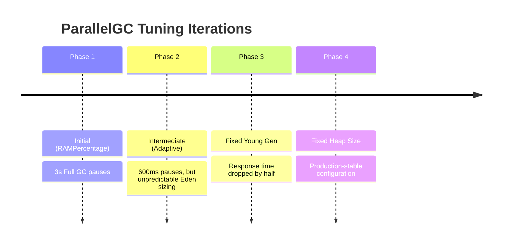
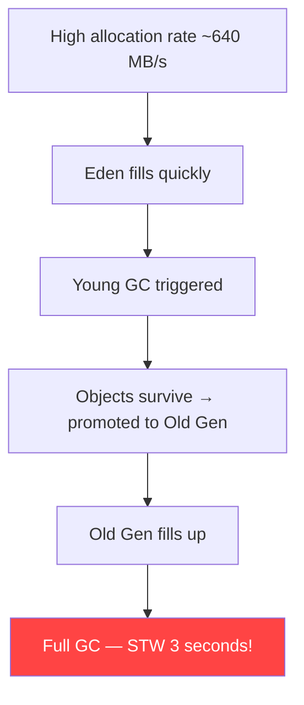
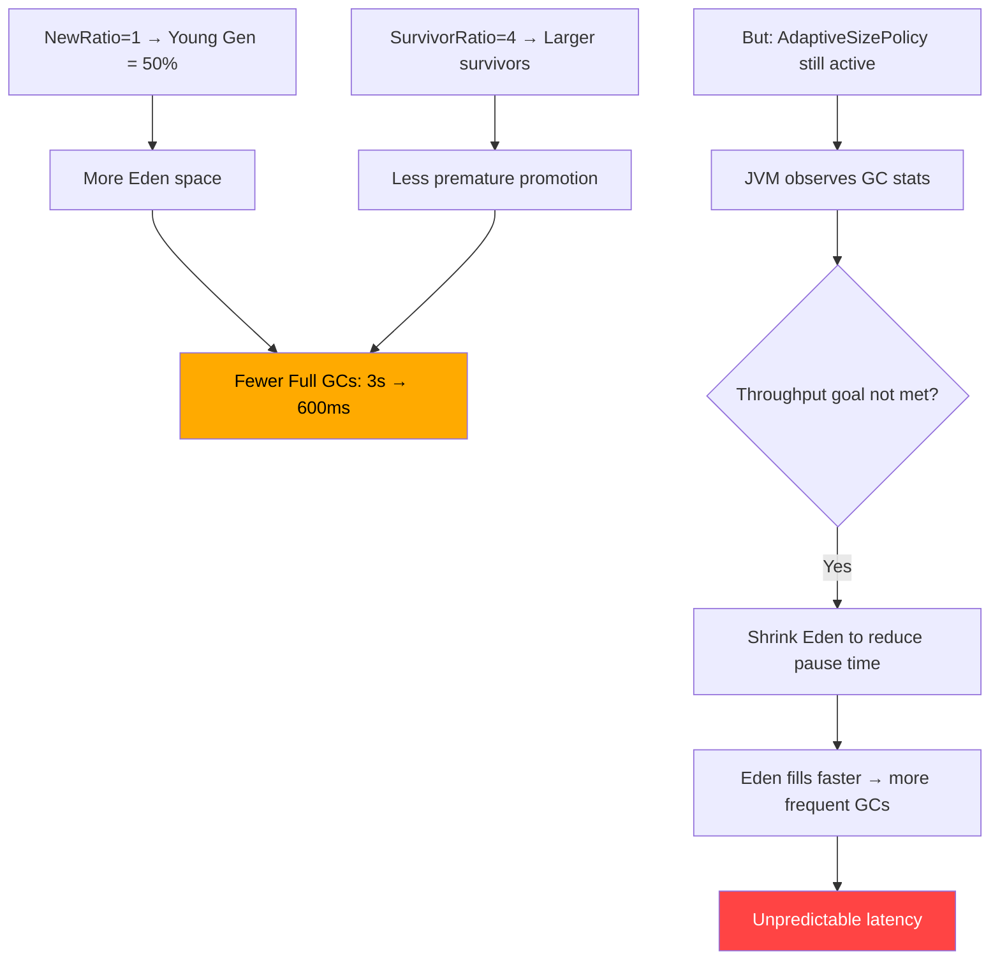
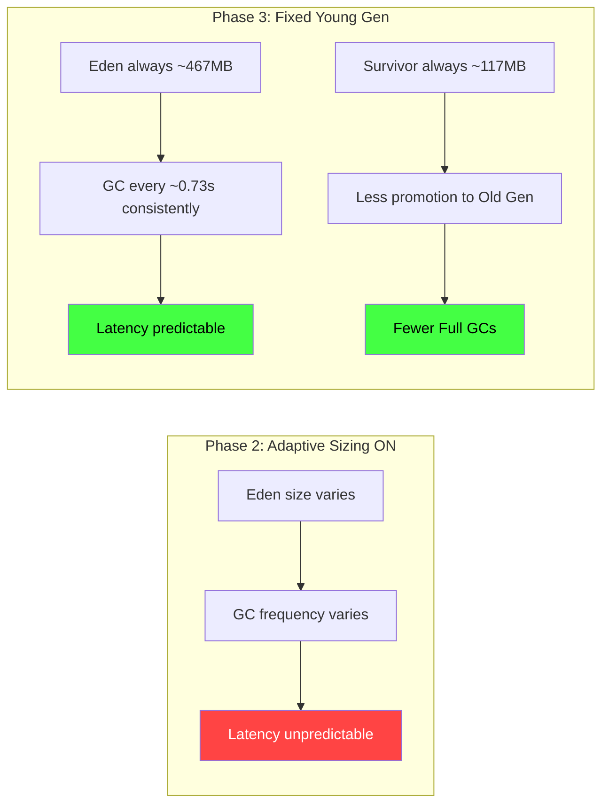
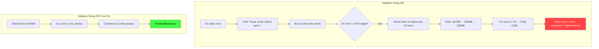
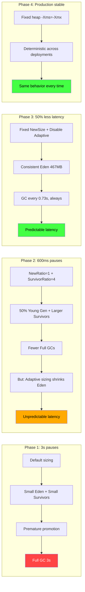

# ParallelGC Optimization Journey — From 3s Pauses to Half the Response Time

This document tells the real-world story of ParallelGC tuning for a high-throughput BFF (Backend-for-Frontend) application. It covers four iterations of JVM parameter tuning, explaining what each flag does, why it was changed, and the observed impact.

## Example Context similar to what I got at work

- **Workload**: BFF proxy that calls downstream services, receives ~50KB JSON responses, and forwards them to clients
- **Allocation rate**: ~640 MB/s (objects created and destroyed rapidly — no caching)
- **Container**: 2 CPU cores, 2GB RAM
- **JVM**: Java 24, Spring Boot 3.4.5, Undertow (200 worker threads)
- **Heap**: Fixed at 1536m (leaves ~512MB for native memory)

---

## The Journey — 4 Iterations



---

### Phase 1: Initial Configuration — The 3-Second Pauses

```bash
-XX:InitialRAMPercentage=75
-XX:MaxRAMPercentage=75
-XX:+UseParallelGC
-XX:MaxGCPauseMillis=200
-XX:GCTimeRatio=9
```

**What happened**: Full GC pauses of **~3 seconds**.

**Why**:



**Flag analysis**:

| Flag | What it does | Problem |
|------|-------------|---------|
| `-XX:InitialRAMPercentage=75` | Sets initial heap to 75% of container memory (1500MB) | Good starting point |
| `-XX:MaxRAMPercentage=75` | Sets max heap to 75% of container memory | Reasonable |
| `-XX:+UseParallelGC` | Parallel scavenge collector | Correct choice for throughput |
| `-XX:MaxGCPauseMillis=200` | Hint: target 200ms max pause | JVM can't achieve this with default sizing |
| `-XX:GCTimeRatio=9` | Target 10% GC time (1/(1+9)) | Good, but not enough without other changes |

**Root cause**: The JVM used **default generation ratios** (Young Gen ≈ 33% of heap). With only ~500MB for Eden and a 640 MB/s allocation rate, Eden fills in ~0.8 seconds. Objects that survive multiple Young GCs get promoted to Old Gen. With the default `SurvivorRatio=8`, each survivor space is only ~50MB — easily overflowed during traffic spikes, causing **premature promotion** to Old Gen. Once Old Gen fills up → **3-second Full GC**.

**Missing pieces**: No control over young gen size, no survivor tuning, no thread count control.

---

### Phase 2: Intermediate — Adaptive Sizing with Tuning

```bash
-XX:MaxRAMPercentage=75
-XX:+UseParallelGC
-XX:MaxGCPauseMillis=200
-XX:GCTimeRatio=9
-XX:+UseStringDeduplication
-XX:SurvivorRatio=4
-XX:ParallelGCThreads=2
-XX:NewRatio=1
-XX:+UseAdaptiveSizePolicy
-XX:MaxHeapFreeRatio=100
```

**What happened**: Full GC pauses dropped from **3s → ~600ms**. But latency was still unpredictable.

**What changed**:

| Flag | Change | Impact |
|------|--------|--------|
| `-XX:SurvivorRatio=4` | Added — larger survivor spaces (16.7% vs 10%) | Fewer premature promotions → fewer Full GCs |
| `-XX:ParallelGCThreads=2` | Added — match container CPU count | No context switching during GC |
| `-XX:NewRatio=1` | Added — Young Gen = 50% of heap | More space for short-lived objects |
| `-XX:+UseAdaptiveSizePolicy` | Explicitly enabled (was already on by default) | JVM dynamically adjusts generation sizes |
| `-XX:+UseStringDeduplication` | Added — deduplicate String objects | Less String waste in Old Gen |
| `-XX:MaxHeapFreeRatio=100` | Added — never shrink heap | Prevents heap resize overhead |

**Why it helped (but wasn't enough)**:



**The remaining problem**: With `UseAdaptiveSizePolicy` enabled, the JVM dynamically adjusts generation sizes. It observed that GC was taking more than the target time and started **shrinking Eden** to keep individual pauses short. But a smaller Eden fills faster → more frequent GCs → the JVM shrinks Eden more → **death spiral**.

This is the core tension between two conflicting goals:
- `MaxGCPauseMillis=200` → "Make each GC fast" → shrink Eden
- `GCTimeRatio=9` → "Spend ≤10% time in GC" → do fewer GCs → grow Eden

The JVM kept oscillating between these goals, causing **unpredictable latency**.

---

### Phase 3: Fixed Young Gen — The Breakthrough

```bash
-XX:MaxRAMPercentage=75
-XX:+UseParallelGC
-XX:MaxGCPauseMillis=200
-XX:GCTimeRatio=9
-XX:SurvivorRatio=4
-XX:ParallelGCThreads=2
-XX:NewSize=650m
-XX:MaxNewSize=750m
-XX:-UseAdaptiveSizePolicy
-XX:MaxHeapFreeRatio=100
```

**What happened**: Response time **dropped by ~50%**. GC became predictable and consistent.

**The critical changes**:

| Flag | Change | Why |
|------|--------|-----|
| `-XX:NewSize=650m` | **Replaced** `-XX:NewRatio=1` | Fix minimum young gen to 650MB |
| `-XX:MaxNewSize=750m` | **Added** | Cap young gen at 750MB |
| `-XX:-UseAdaptiveSizePolicy` | **Changed** from `+` to `-` | **Disable** adaptive sizing |

**Why this was the breakthrough**:



With fixed young gen sizes:
- **Eden** = 700MB - 2×117MB = **~467MB** (consistent)
- At 640 MB/s allocation rate → Young GC every **~0.73 seconds** (predictable)
- Each Young GC pauses for **2.5–6ms** (consistent)
- Larger survivors (117MB each) absorb traffic spikes without promoting to Old Gen

---

### Phase 4: Fixed Heap Size — Production Stable

```bash
-Xms1536m
-Xmx1536m
-XX:+UseParallelGC
-XX:MaxGCPauseMillis=200
-XX:GCTimeRatio=9
-XX:SurvivorRatio=4
-XX:ParallelGCThreads=2
-XX:NewSize=650m
-XX:MaxNewSize=750m
-XX:-UseAdaptiveSizePolicy
-XX:MaxHeapFreeRatio=100
```

**What changed**: Replaced `-XX:MaxRAMPercentage=75` with fixed `-Xms1536m -Xmx1536m`.

**Why**: In production, using `RAMPercentage` means the JVM calculates heap size from the container's memory limit. If the container memory limit changes (e.g., Kubernetes adjusts resource limits), the heap size changes unexpectedly. A fixed heap size is **deterministic** — the same on every deployment.

**This is the configuration used in Scenario 2** (`blocking-parallelgc-tuned`) of this PoC.

---

## Detailed Flag Reference

### `-XX:+UseParallelGC`

Selects the Parallel Scavenge collector for the young generation. In Java 24, this uses PS MarkSweep for the old generation. It's a **stop-the-world, throughput-oriented** collector — maximizes application throughput at the cost of individual pause times.

**Default**: G1GC (since Java 9). Must be explicitly enabled.

---

### `-XX:MaxGCPauseMillis=200`

A **hint** (not a guarantee) to the GC about the desired maximum pause time in milliseconds. The adaptive sizing policy uses this to decide generation sizes.

- **Default**: 200ms (same as what we set, but making it explicit ensures consistency)
- **Effect with adaptive sizing**: JVM shrinks young gen to keep pauses under 200ms
- **Effect without adaptive sizing** (our Phase 3/4): Has no effect — generation sizes are fixed

---

### `-XX:GCTimeRatio=9`

Sets the target ratio of GC time to application time:

```
GC time target = 1 / (1 + GCTimeRatio)
```

| Value | GC Time Budget | Use Case |
|-------|---------------|----------|
| 99 (default) | 1% | Batch jobs, analytics |
| 9 (our setting) | 10% | Web services, APIs |
| 4 | 20% | Latency-critical services |
| 1 | 50% | Extreme low-latency |

**Why 9**: The default `GCTimeRatio=99` (1% budget) is too aggressive for a high-allocation BFF. The JVM tries to minimize GC time by doing fewer, larger GCs — but with adaptive sizing, this conflicts with `MaxGCPauseMillis`. Setting 9 (10% budget) relaxes this pressure.

---

### `-XX:SurvivorRatio=4`

Controls the ratio between Eden and each Survivor space:

```
Survivor space = Young Gen / (SurvivorRatio + 2)
Eden = Young Gen - 2 × Survivor space
```

| SurvivorRatio | Each Survivor | Eden (700MB young gen) |
|---------------|--------------|----------------------|
| 8 (default) | 10% = 70MB | 560MB |
| 6 | 12.5% = 87.5MB | 525MB |
| **4 (ours)** | **16.7% = 117MB** | **467MB** |
| 2 | 25% = 175MB | 350MB |

**Why 4**: Larger survivor spaces act as a buffer during traffic spikes. When more objects survive a Young GC than usual, they fit in the survivor space instead of being promoted to Old Gen. This prevents Old Gen from filling up and triggering Full GCs.

---

### `-XX:ParallelGCThreads=2`

Number of threads used for parallel garbage collection.

**Default**: `min(N, 8)` where N = available CPUs. In Docker, the JVM may detect the host's full CPU count (e.g., 6 cores) and create 6 GC threads — but the container is limited to 2 CPUs, causing context switching overhead.

**Why 2**: Match the container's CPU limit exactly. Each GC thread gets a dedicated CPU core.

---

### `-XX:NewSize=650m` and `-XX:MaxNewSize=750m`

Fix the young generation (Eden + 2 Survivor spaces) to a specific range.

**Default**: The JVM dynamically sizes the young generation. With `NewRatio=1`, Young = 50% of heap. Without any setting, Young ≈ 33%.

**Our setting**: 650–750 MB = 42–49% of 1536MB heap.

**Memory layout**:

```
┌─────────────────────────────────────────────────────────┐
│                    Heap (1536 MB)                        │
├───────────────────────────────────┬─────────────────────┤
│       Young Gen (700 MB)          │   Old Gen (836 MB)  │
├──────────┬──────────┬────────────┤                     │
│ Survivor │  Eden    │ Survivor   │                     │
│  117 MB  │ 467 MB   │  117 MB    │                     │
└──────────┴──────────┴────────────┴─────────────────────┘
```

**Why this matters**: At 640 MB/s allocation rate:
- Eden (467MB) fills in ~0.73 seconds
- Young GC occurs every ~0.73 seconds — **consistent and predictable**
- Compare with adaptive sizing: Eden could shrink to 200MB → GC every 0.31 seconds → 2.3× more GCs

---

### `-XX:-UseAdaptiveSizePolicy`

**Disables** the JVM's adaptive generation sizing policy. This is the most impactful flag in the entire tuning journey.

**What adaptive sizing does** (when enabled):
1. After each GC, measures pause time, throughput, and footprint
2. Adjusts Eden, Survivor, and Old Gen sizes to optimize for `MaxGCPauseMillis` and `GCTimeRatio`
3. Can grow or shrink generations by 10-20% between GCs

**Why disable it**: For a BFF proxy with a **consistent, predictable high allocation rate**, adaptive sizing is counterproductive:



---

### `-XX:MaxHeapFreeRatio=100`

Maximum percentage of heap that can be free after GC before the JVM attempts to shrink the heap.

- **Default for ParallelGC**: 100% (same as our setting)
- **Why set it explicitly**: Safety net. If you ever switch GCs or if defaults change between Java versions, this ensures the JVM **never shrinks the heap**. With `-Xms=-Xmx`, it's technically redundant but prevents any resize overhead.

---

### `-Xms1536m -Xmx1536m`

Sets initial (`-Xms`) and maximum (`-Xmx`) heap size. When equal, the heap is **fixed** — no resizing at runtime.

**Why 1536m in a 2GB container**:

```
Container memory limit:     2048 MB
├── JVM Heap:               1536 MB  (75%)
├── Thread stacks:           200 MB  (~200 threads × 1MB)
├── Metaspace:               100 MB  (class metadata)
├── Code cache:               60 MB  (JIT compiled code)
├── Direct buffers:           50 MB  (NIO)
├── JVM internals:            50 MB  (GC data structures, etc.)
└── Safety margin:            52 MB
```

---

## Summary: The Complete Picture



| Metric | Phase 1 | Phase 2 | Phase 3 | Phase 4 |
|--------|---------|---------|---------|---------|
| Full GC pause | ~3s | ~600ms | Rare | Rare |
| Young GC pause | Variable | Variable | 2.5–6ms | 2.5–6ms |
| GC frequency | Unpredictable | Unpredictable | Every ~0.73s | Every ~0.73s |
| Response time | Baseline | -30% | **-50%** | **-50%** |
| Latency variance | High | Medium | Low | Low |
| Predictability | ❌ | ⚠️ | ✅ | ✅ |


